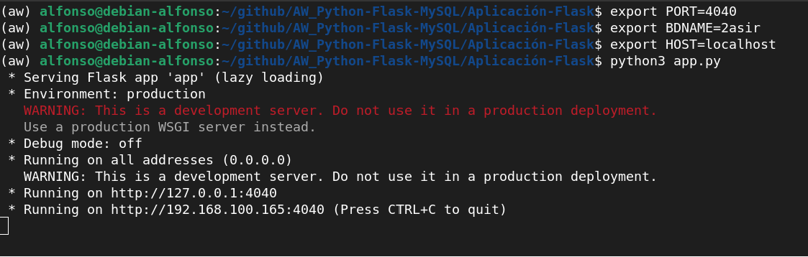
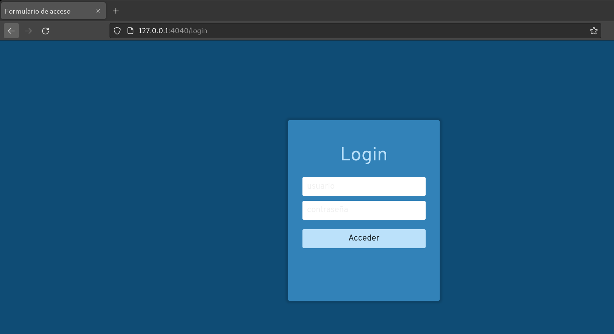
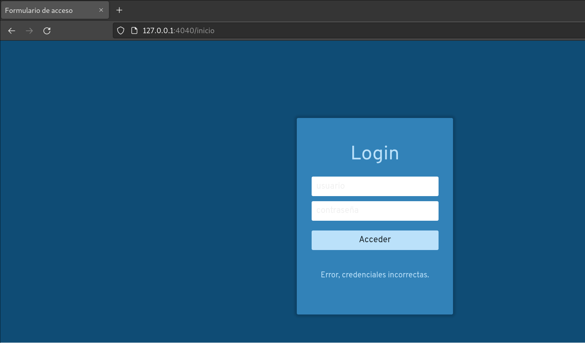
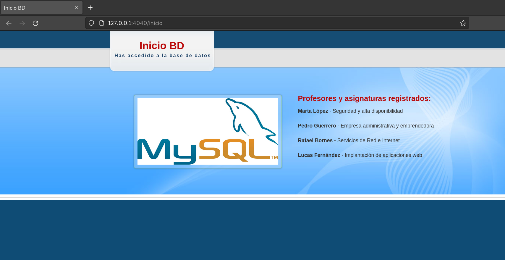

# AW_Python-Flask-MySQL
Aplicación Web (Python + Flask + MySQL) - Administración de sistemas gestores de bases de datos

## Preparación del entorno virtual

Comenzamos instalando la paquetería necesaria:

```
sudo apt update
sudo apt install python3-venv
```

Creación del entorno virtual (Podemos hacerlo en cualquier directorio):

`python3 -m venv nombre_del_entorno`

Activación del entorno virtual:

`source virtualenv/carpeta/bin/activate`

Desactivar el entorno virtual:

`deactivate`

Una vez iniciemos el entorno virtual, instalaremos la paquetería requerida:

`pip install -r requirements.txt`

## Creación de usuario, base de datos y tablas.

Seguiremos los pasos indicados en el fichero [2asir.sql](2asir.sql)

## Ejecución del programa python.

Podemos encontrar los ficheros [programa.py](Programa/programa.py) y [funciones.py](Programa/funciones.py) dentro del directorio "Programa".

### Comprobación del funcionamiento:

.png)

## Ejecución de la aplicación Flask

Podemos encontrar los ficheros la aplicación web (Python + Flask + MySQL) en el directorio [Aplicación-Flask](Aplicación-Flask). 

Antes que nada, comenzamos definiendo las variables del entorno que requiere la aplicación.

```
export PORT=4040
export BDNAME=2asir
export HOST=localhost 
```

Podemos ver nuestras variables del entorno con el comando:
`printenv`

### Comprobación del funcionamiento:

Ejecutamos la aplicación:

`python3 app.py`



Accedemos desde el navegador web, con el puerto definido:



Como vemos, se muestra la ventana de Login.

Probaremos a introducir unas credenciales incorrectas:



Vemos que nos redirecciona de nuevo a la página de login, y además nos muestra un mensaje indicando que las credenciales introducidas son incorrectas.

Ahora sí, accedemos con las credenciales del usuario de la base de datos:
Usuario: **alfonso**
Contraseña: **passbd**



Como vemos, se muestra la página de inicio, con información sobre una consulta referente a las tablas **"Profesor"** y **"Asignatura"**.


